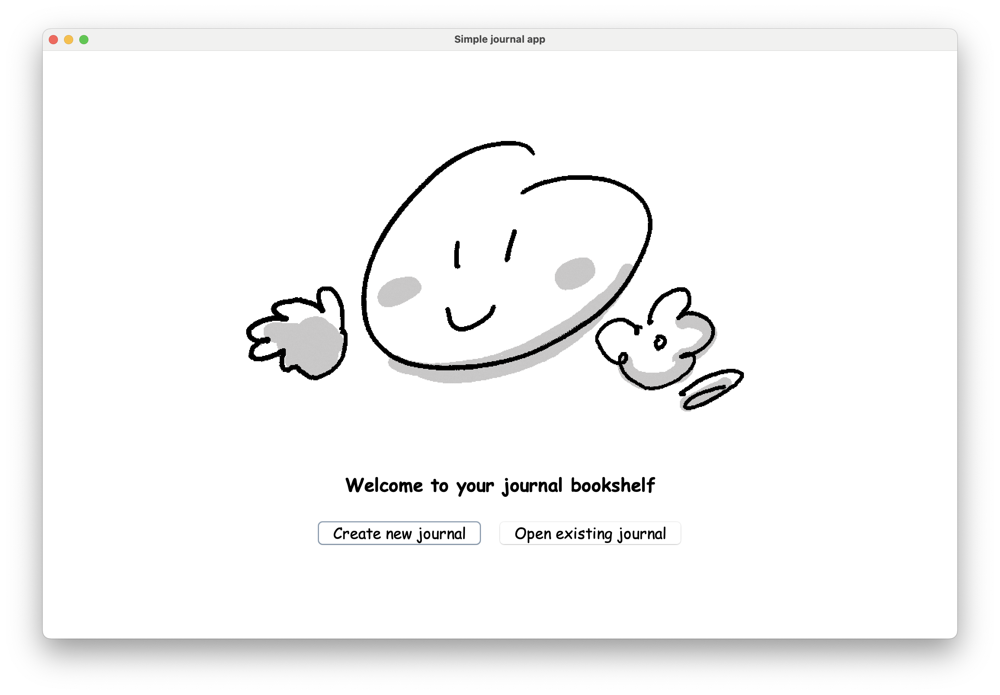
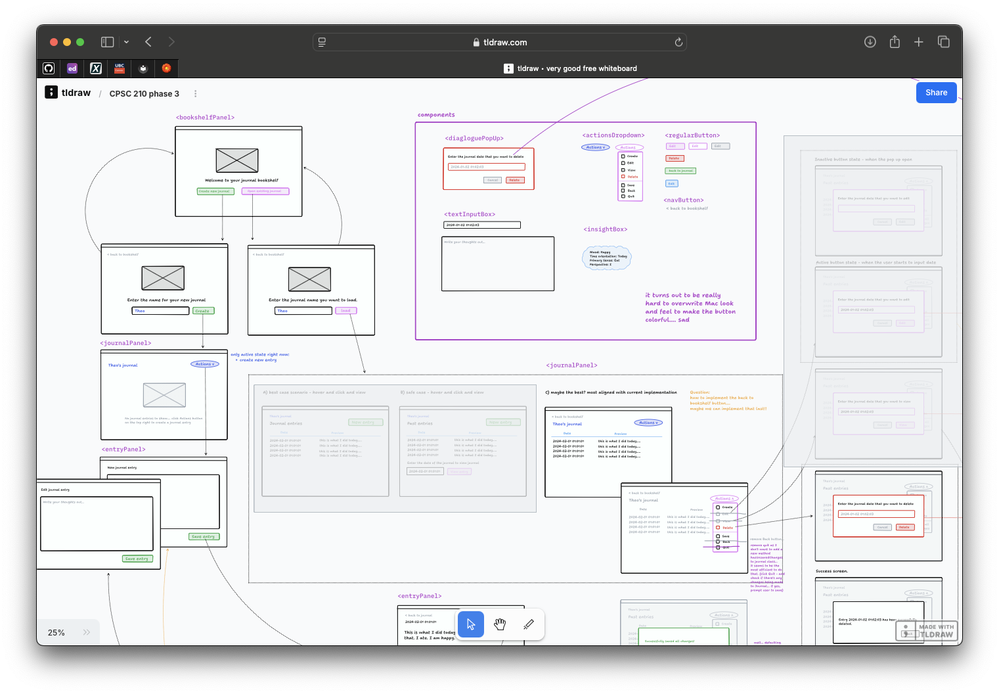

# Journaling app with text analysis 
Course project for CPSC 210 at the University of British Columbia 

## About the project

### What is this? 
This is a journalling app that encourages distraction-free, free-flow expressive writing, or what I like to call brain-dumping everything out. It also provides research-backed text-analysis on your mood, focus and overall state-of-mind. 

### Who will use it? 
Honestly, everyone. But to start, I'll be testing it with myself and my friends.  

### Why this project interests me: 

*"The words people use in their daily lives can reveal important aspects of their social and psychological worlds"*. This is especially true for [expressive writing](https://www.psychologytoday.com/ca/blog/write-yourself-well/201208/expressive-writing). 

I journal regularly and find free-flow writing to be a powerful way to clear my mind. Inspired by the [*"What’s Hidden in Your Words"* 
](https://hiddenbrain.org/podcast/whats-hidden-in-your-words/) episode of the *Hidden Brain* podcast, I want to create a journalling app that not only encourages this kind of writing but also offers meaningful statistics on the words we use to explore our state of mind. 

It's important to note that similar applications already exist, such as [750words](https://750words.com), or the software created by Professor James W.Pennebaker (the guest speaker in the podcast), [LIWC](https://liwc.app). However, they either store data on the cloud or requires an expensive license, neither of which I love. I want something secure and private, where my journalling content never touches the internet. So this is why I want to build this project myself. It gies me full control over the interface and functionality to create exactly what I need. 

I understand that implementing a robust text analysis algorithm is ambitious, so my goal is to start with a simple version and draw inspirations from 750words or LIWC. To deepen my understanding of the relationship between linguistics and cognition, I just checked out this book today and will start reading [The Secret Life of Pornouns](https://www.kobo.com/ca/en/ebook/the-secret-life-of-pronouns) by Professor James Pennebaker. This will help me design and implement the basic model. 

### Other relevant research and resources: 
- [Benefits of free-writing (testimonials from 750 words)](https://medium.com/750-words/i-analyzed-15-years-of-testimonials-from-users-of-750words-com-to-learn-how-journaling-helped-them-9665c93814e8)
- [Mind Mapping: Using Everyday Language to Explore Social & Psychological Processes](https://www.sciencedirect.com/science/article/pii/S1877050917323530), by James W. Pennebaker, Procedia Computer Science, 2017. 
-  [The Psychological Meaning of Words: LIWC and Computerized Text Analysis Methods](https://journals.sagepub.com/doi/10.1177/0261927X09351676). by ausczik, Y. R., & Pennebaker, J. W. ,2010.
- [The Secret Life of Pronouns: Flexibility in Writing Style and Physical Health](https://journals.sagepub.com/doi/10.1111/1467-9280.01419), by R. Sherlock Campbell and James W. Pennebaker, Psychological Science, 2003. 
- [Psychological Aspects of Natural Language Use: Our Words, Our Selves](http://cognaction.org/cogs105/readings/LIWC.pdf), by James W. Pennebaker, Matthias R. Mehl, and Kate G. Niederhoffer, Annual Review of Psychology, 2003. 

## Mock-up for GUI
[Click here to view the design mock-ups for the app](https://www.tldraw.com/p/jFglMOsh4VRXvB9Vza7SG?d=v-292.1950.5431.3330.page). Used tldraw;. 

## User stories

**Persistence** 

- As a user, I want to be able to save my journal entries to file (if I so choose). 
- As a user, when I select the quit option from menu, I want to be reminded to save my journal entries to file and have the option to do so or not. 
- As a user, when I start the application, I want to be given the option to load a past journal from file. 
- As a user, when I start the application, I want to be given the option to create a brand new journal. 

**Entry creation & management** 

- As a user, I want to add a new journal entry so that I can document my thoughts and experiences.
- As a user, I want to view a list of all my journal entries, including their date and time, so that I can easily find past entries.
- As a user, I want to select a journal entry from the list and view its full content so that I can revisit what I wrote.
- As a user, I want to edit an existing journal entry so that I can update or refine my thoughts.
- As a user, I want to delete a journal entry so that I can remove content I no longer want to keep.
- As a user, I want a distraction-free writing environemnt so that I can focus on journalling without disruptions. 

**Text analysis** 

- As a user, I want to view the text analysis of a specific journal entry so that I can gain insights into my mood and focus for that entry

## Instructions for End User (GUI)
- You can generate the first required action related to the user story "adding multiple Xs to a Y" by viewing all the journal entries added on the journal page. 
- You can generate the second required action related to the user story "adding multiple Xs to a Y" by creating and adding a new journal entry to the journal with the "create" button inside the action button drop down. 
- You can generate the third required action related to the user story "adding multiple Xs to a Y" by deleting a selected journal entry to the journal with the "delete" button inside the action button drop down. 
- You can locate my visual component on welcome screen, create new journal screen, load journal screen, as well as empty journal screen and view journal entry screen.  
- You can save the state of my application by selecting the "save" button inside the action button drop down. 
- You can reload the state of my application by selecting loading an existing journal on the welcome screen and inputting the name of the journal you are looking for in the journal name input. 

## Thoughts dump (user stories)
- Relying on the user's computer security control so i am not thinking about adding password protection. Assuming that the user will keep their laptop secure. However, password-control could be added if there's time. 
- Relying on the user's operating system for quick-hide functionality (quickly hide away the application). For example, on mac, users can use command-H to quickly hide the active application.  
- Relying on the user's ability to navigate file systems for exporting entries. Would like to provide a location path so the user can navigate there and see their entry records. 

## Thoughts dump (to-dos)
- (not implemented) As a user, I want to see overall statistics across all my journal entries so that I can track trends in my writing over time.
- Would be nice to have more robust text analysis. 
- Would be nice to have charts. 
- Did not implement the name check for "create new journal" - could be added in the future. 